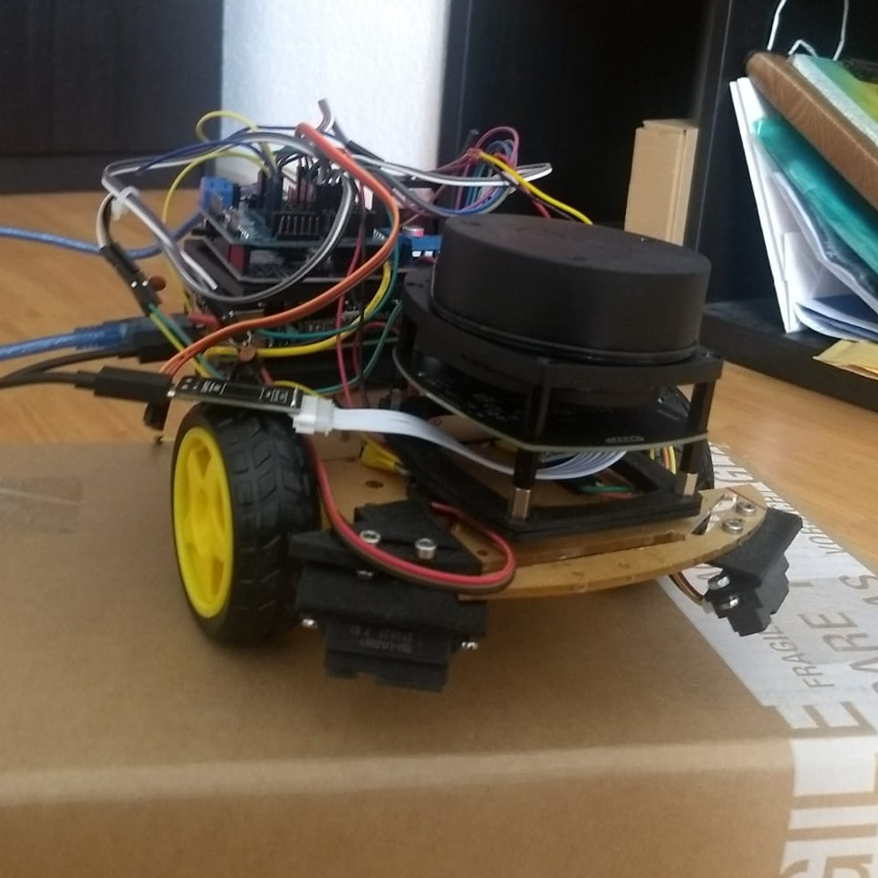
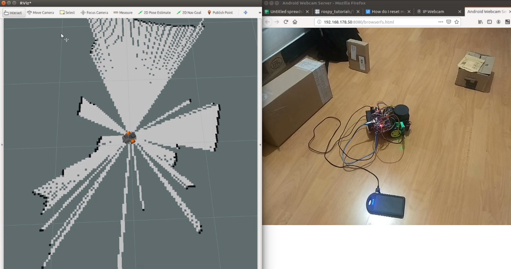

# ROS-Arduino-2wd-robot
ROS Arduino Robot 

The Project is to create a mapping 2wd robot using Arduino Uno with ROS and RPLidar

The Bot uses Joystick control for motion(differential drive model) and hector slam for mapping

NOTE:Hector Slam is Without Odom data as it's geneneration is too heavy for Arduino UNO
